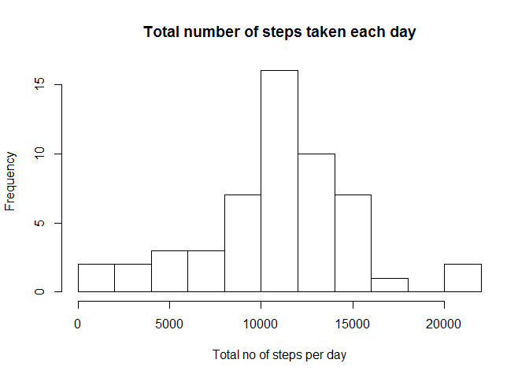
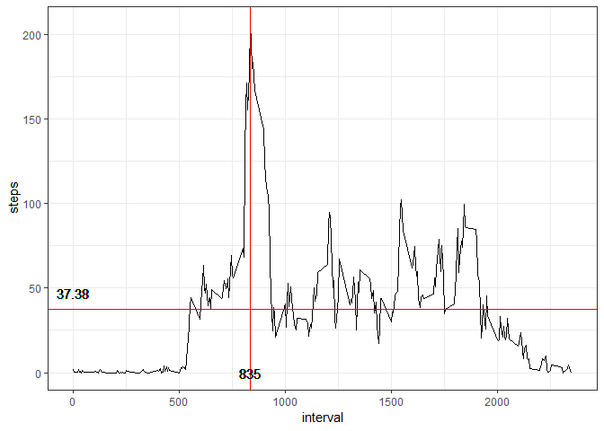
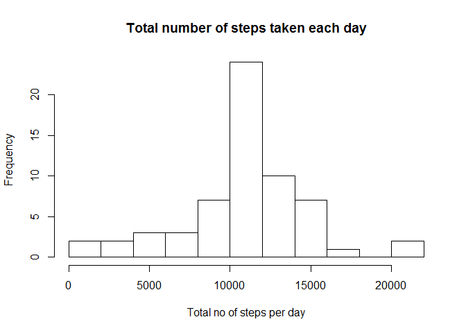
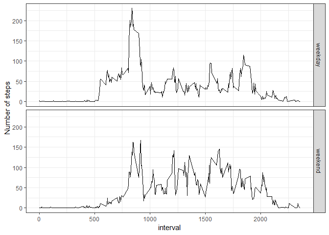

## Install libraries


```r
library(dplyr)
```

```
## Warning: package 'dplyr' was built under R version 3.5.3
```

```
## 
## Attaching package: 'dplyr'
```

```
## The following objects are masked from 'package:stats':
## 
##     filter, lag
```

```
## The following objects are masked from 'package:base':
## 
##     intersect, setdiff, setequal, union
```

```r
library(ggplot2)
```

```
## Warning: package 'ggplot2' was built under R version 3.5.3
```

## Loading and preprocessing the data

```r
unzip("activity.zip")
act <- read.csv("activity.csv")
dfAct <- as.data.frame.matrix(act)
```

## What is mean total number of steps taken per day?


```r
daily_sum_steps <- dfAct %>%
  mutate(day = as.Date(date, format="%Y-%m-%d")) %>%
  group_by(day) %>% # 
  summarise(total_steps=sum(steps)) #%>%  
  

hist(daily_sum_steps$total_steps, breaks=10, xlab="Total no of steps per day", main="Total number of steps taken each day")
```

<!-- -->
The mean and the medium of the total number of steps taken per day:


```r
mean(daily_sum_steps$total_steps)
```

```
## [1] NA
```

```r
median(daily_sum_steps$total_steps)
```

```
## [1] NA
```


## What is the average daily activity pattern?

```r
mean_y <- mean(dfAct$steps, na.rm = TRUE)
dfAct$grp.mean.values <- ave(dfAct$steps, dfAct$interval, FUN=function(x) mean(x, na.rm=T))
max_x <- dfAct$interval[which.max(dfAct$grp.mean.values)]

ggplot(data = dfAct, aes(x = interval, y = steps)) + 
  stat_summary(fun.y = mean, na.rm = TRUE, geom ='line') +
  geom_hline(yintercept=mean_y, color = "red") +
  geom_vline(xintercept=max_x, color="red") +
  geom_text(aes(0,mean_y,label = round(mean_y,2), vjust = -1)) +
  geom_text(aes(max_x,0,label = round(max_x,2))) + 
  theme_bw()
```

<!-- -->
The total number of missing values in the dataset are:

## Imputing missing values

```r
sum(is.na(dfAct$steps))
```

```
## [1] 2304
```


```r
dfActNoNA <- dfAct
dfActNoNA$steps[is.na(dfActNoNA$steps)] <- dfActNoNA$grp.mean.values[is.na(dfActNoNA$steps)] 

daily_sum_steps_2 <- dfActNoNA %>%
  mutate(day = as.Date(date, format="%Y-%m-%d")) %>%
  group_by(day) %>% # 
  summarise(total_steps=sum(steps)) #%>%  
  

hist(daily_sum_steps_2$total_steps, breaks=10, xlab="Total no of steps per day", main="Total number of steps taken each day")
```

<!-- -->

The mean and the medium of the total number of steps taken per day:


```r
mean(daily_sum_steps_2$total_steps)
```

```
## [1] 10766.19
```

```r
median(daily_sum_steps_2$total_steps)
```

```
## [1] 10766.19
```

## Are there differences in activity patterns between weekdays and weekends?


```r
dfActNoNA$date <- as.Date(dfActNoNA$date)
weekdays1 <- c('mandag', 'tirsdag', 'onsdag', 'torsdag', 'fredag')
dfActNoNA$wDay <- c('weekend', 'weekday')[(weekdays(dfActNoNA$date) %in% weekdays1)+1L]


dfAvg_Wday <- dfActNoNA %>%
  group_by(wDay, interval)  %>%
  summarize(avg_weekday = mean(steps))

p <- ggplot(dfAvg_Wday, aes(interval, avg_weekday)) + geom_line()

p + facet_grid(rows = vars(wDay)) + 
  labs(y= "Number of steps") +
  theme_bw()
```

<!-- -->
